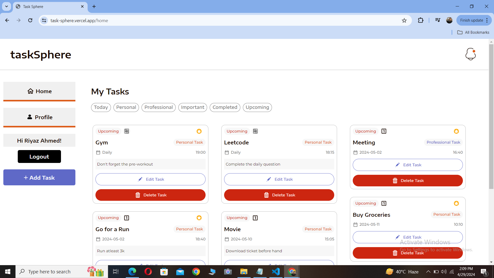
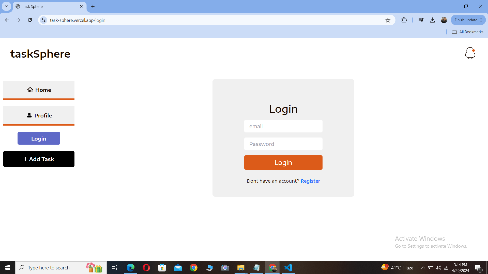
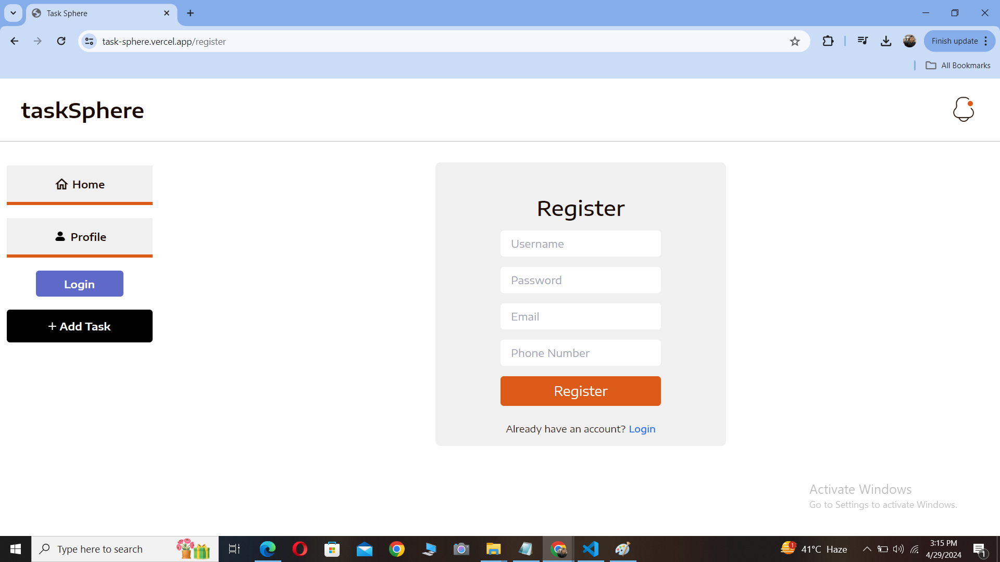
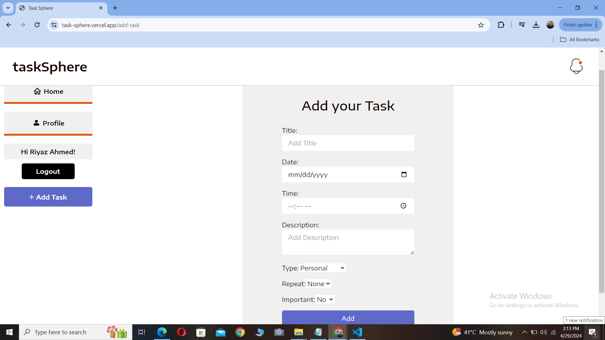

<p align="center"></p>

### taskSphere is an application to add all your task so that you never forget one

- Add various types of task in your day to day life
- Create an account to get started now!

### Features

- You can add a task of specific type
- A task can be personal/Professiona , important/not, repeat once/Daily
- with the help of the filters present on the screen, one can also filter taks to view
- One can edit/delete his task anytime
- Once the task is completed it will be tagged completed (else upcoming)

### Upcoming Features

- Reminders and notifications of tasks upcoming very soon


## A sneak peek into what we have here!

Visit my website at: https://task-sphere.vercel.app/

### Home Page - Desktop



### Home Page - Mobile


### Login Page - Desktop



### Register Page - Desktop



### Add Task Page - Desktop




## Technology Stack

- **Coding Languages**:   

- **Tools & Frameworks**:     

- **Project Management Tools**:  

<hr>

## Environment Setup for local use-

- Drop a :star: on the GitHub repository.
  <br/>

- Download and install a code/ text editor. - Recommended- - [Download VS Code](https://code.visualstudio.com/download) 
  <br/>

- Download [Node Js and npm(Node package manager)](https://nodejs.org/en/) (when you install Node, npm also gets installed by default)
  <br/>


- Download and extract the github repositor
<br/>

- Open the project (taskSphere-main) using VS Code
  <br/>

- Open a new terminal and enter `cd frontend` to navigate to the front end of the project
<br/>

- Run this command to install all dependencies for the frontend of this project.

```
npm install
```

<br/>

- Now run this command to start the project.

```
npm start
```
<br/>

- Now you are all set to use this project.

## Developer

- Md Riyaz Ahmed
