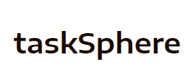

<p align="center"></p>

### taskSphere is an application to add all your task so that you never forget one

- Select and book your trip from a range of Packages
- We offer additional activities at each destination to make your trip more memorable
- Create an account to book yor trip and view them anytime!

### Features

- You can view all tha available destinations and packages in the home page
- By clicking on book now on the tour package you can view all the details of the tour
- A tour has a fixed Iternary of destinations.
- Additional to the normal Iternary you can add addition activities at that destination 
- You can also view the passenger list of the passage by clicking get passenger list
- Each tour package has a vacancy, you cannot book if it is less that the guest size you are booking for
- It also applies for the activities
- The discount is applied according to you membership (premium user: 50%, gold user 10% , normal user 0%)
- Once you have booked your tour you can view your booking details by clicking on Bookings in the headers section
- For testing purpose you can change your membership and balance by clicking on your name in the header section

## A sneak peek into what we have here!

Visit my website at: https://task-sphere.vercel.app/

### Home Page - Desktop


### Home Page - Mobile


## Technology Stack

- **Coding Languages**:   

- **Tools & Frameworks**:     

- **Project Management Tools**:  

<hr>

## Environment Setup for local use-

- Drop a :star: on the GitHub repository.
  <br/>

- Download and install a code/ text editor. - Recommended- - [Download VS Code](https://code.visualstudio.com/download) 
  <br/>

- Download [Node Js and npm(Node package manager)](https://nodejs.org/en/) (when you install Node, npm also gets installed by default)
  <br/>


- Download and extract the github repositor
<br/>

- Open the project (taskSphere-main) using VS Code
  <br/>

- Open a new terminal and enter `cd frontend` to navigate to the front end of the project
<br/>

- Run this command to install all dependencies for the frontend of this project.

```
npm install
```

<br/>

- Now run this command to start the project.

```
npm start
```
<br/>

- Now you are all set to use this project.

## Developer

- Md Riyaz Ahmed
